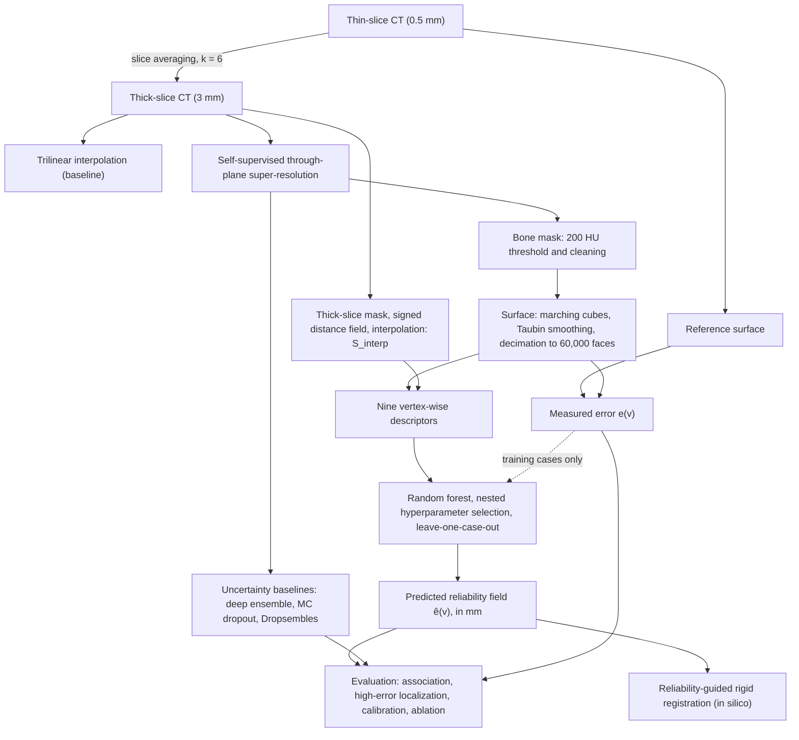

# Vertex-wise geometric reliability of bone surfaces reconstructed from thick-slice CT

Code and data pointers for the paper *Automated Vertex-Wise Geometric Reliability Mapping for 3D Bone Surface
Reconstruction from Thick-Slice CT* (R. D. C. Silva, D. S. Silva, R. S. Astolfi, V. H. C. de Albuquerque).

Given a bone surface reconstructed from thick-slice CT, the method predicts at every mesh vertex how far the surface is
expected to be from the true one, in millimetres, without a higher-resolution reference for that case. A random forest
maps nine descriptors of the reconstructed mesh and of the acquisition to the local surface error. The repository
contains everything needed to rerun the experiments and compare the output with the results reported in the paper.

## Pipeline



The thoracic cohort (RPLHR-CT) follows the same chain starting from scanner-generated 5-mm and 1-mm reconstructions
instead of simulated thick slices.

## Repository layout

```
src/reliability/            the package
  a4_config.py              every protocol constant, with the section or equation of the paper it implements
  a4_data.py                thick-slice simulation, trilinear baseline, RPLHR-CT loading
  a4_sr.py                  self-supervised super-resolution (network in src/mr_superres.py)
  a4_surface.py             segmentation, surface extraction, surface error e(v)
  a4_features.py            the nine descriptors, including the shape disagreement d_shape
  a4_uncertainty.py         uncertainty baselines in intensity and surface space
  a4_registration.py        registration experiment
  a4_statistics.py          metrics and paired tests
  a4_cohort.py              screening of the foot cohort (62 examinations -> 48 feet)
  a4_run_foot.py            one pass per foot; writes one cache file per case
  a4_run_thorax.py          one pass per thoracic case
  a4_optimize_rf.py         nested selection of the random-forest hyperparameters
  a4_analyses.py            one result file per Results subsection
  sr_selection/             selection of the super-resolution learning rate and iterations
  supplement/sensitivity/   sensitivity analysis
  supplement/exact_error.py check of the error measurement (sampling floor, exact distance, tails)
  figures/                  figure scripts
  tests/                    unit tests
scripts/                    data preparation, quick check, full run, comparison with the reference results
data/                       case lists, checksums, one sample foot (see data/README.md)
reference_results/          result files of the run reported in the paper
```

## Installation

Python 3.13 and a CUDA GPU (the reference run used an NVIDIA GTX 1660 Ti, 6 GB, and 16 GB of RAM).

```bash
pip install torch            # choose the build for your CUDA version at pytorch.org
pip install -r requirements.txt
```

## Quick check

No download is required for these two steps.

```bash
python scripts/setup_reference.py
python -m pytest src/reliability/tests -q      # unit tests and known-truth tests of the error measurement
python scripts/quick_check.py                  # one foot, about 2 minutes on the GPU above
```

`quick_check.py` runs the reconstruction chain on the sample foot and compares the median surface error of the
super-resolved and trilinear surfaces with the reference run (0.511 mm and 0.526 mm). Add `--cpu --iters 200` to check
that the chain runs without a GPU; the super-resolution numbers will then differ.

## Data

```bash
python scripts/download_foot_data.py                  # 62 foot volumes (1.1 GB), verified by SHA-256
python scripts/prepare_rplhr.py --root /path/to/RPLHR-CT
```

The foot volumes are crops of the VSDFullBody collection and are distributed as a release asset of this repository.
RPLHR-CT must be obtained from its authors. Details, licences and file formats are in [data/README.md](data/README.md).

## Full reproduction

```bash
bash scripts/run_all.sh
```

The script runs, in order:

| Step | Command | Output |
|---|---|---|
| Foot cohort screening | `a4_cohort.py` | list of the 48 retained feet |
| Foot cohort | `a4_run_foot.py` | super-resolution, surfaces, descriptors and uncertainty for each foot |
| Thoracic cohort | `a4_run_thorax.py --partition test` | the same without uncertainty, for the 100 test cases |
| Results | `a4_analyses.py` | one JSON per Results subsection, including the nested random-forest selection |
| Sensitivity | `a4c_sensitivity.py --process`, then `--analyze` | sensitivity to modelling choices |
| Error measurement check | `supplement/exact_error.py` | sampling floor of Eq. 5 and exact error (only with `ERROR_DEFINITION = "sampled"`; a no-op otherwise) |
| Error tails | `supplement/error_tails.py` | mean, 90th percentile and fraction above 2 mm per case (Section 3.1) |
| Median-constant baseline | `supplement/median_constant_baseline.py` | MAE against a constant equal to the median training error (Section 3.3) |
| Calibration and descriptor checks | `supplement/calibration_and_descriptor_checks.py` | slope with/without the vertices at the bound, between-case compression, descriptor-error association, field vs shape disagreement |
| EWC calibration | `supplement/ewc_calibration_check.py` | outcome of the EWC coefficient calibration of every subnetwork |
| Comparison | `scripts/compare_with_reference.py` | every numeric value against the folder matching `ERROR_DEFINITION` (`reference_results/` or `reference_results_exact/`) |

Each step skips the cases already processed, so the run can be interrupted and resumed. Outputs go to
`output/validation/reliability/` (set `A4_OUTPUT_DIR` to change the location). Run one step at a time: the foot pass
trains several networks per case and the analyses use all CPU cores.

### Selection of the super-resolution hyperparameters (optional)

The learning rate and the number of iterations were selected by Bayesian optimization (HEBO 0.3.6) on the 50 RPLHR-CT
validation cases. Each of the 21 evaluations retrains the network for all 50 cases, which took between 36 and 102
minutes per evaluation on the GPU above. The record of that search is in `reference_results/sr_selection_hebo.json`
and the adopted values are fixed in `a4_config.py`, so the search does not need to be repeated. To rerun it, create a
separate Python 3.10 environment with `HEBO==0.3.6` and `pandas`, and run from it:

```bash
python src/reliability/sr_selection/optimize_sr_hebo.py --python /path/to/python/of/the/main/environment
```

### Figures

After the full run, the scripts in `src/reliability/figures/` export the plotted values as CSV and draw the figures
into `output/figures/`:

```bash
python src/reliability/supplement/export_results_data.py
python src/reliability/figures/a4_method_figures.py
python src/reliability/figures/a4_results_figures.py
python src/reliability/figures/a4_mesh_faces.py --foot z002_foot.nii.gz --foot z001_foot.nii.gz
python src/reliability/figures/a4_export_figure_data.py
python src/reliability/figures/a4_final_figures.py
```

## Expected results

Medians across cases with the interquartile range, from `reference_results/`:

| Quantity | Foot (48 feet) | Thorax (100 test cases) |
|---|---|---|
| Surface error, super-resolution (mm) | 0.518 (0.482–0.566) | 0.995 (0.946–1.078) |
| Surface error, trilinear (mm) | 0.528 (0.506–0.557) | 1.119 |
| Vertex-level Spearman correlation of the field | 0.414 (0.366–0.445) | 0.281 (0.255–0.317) |
| Region-level Spearman correlation | 0.597 (0.465–0.721) | 0.783 (0.684–0.837) |
| AUROC, highest-error decile | 0.845 (0.823–0.872) | 0.744 (0.707–0.788) |
| Calibration slope | 0.937 (0.641–1.213) | 1.188 (0.914–1.415) |

Registration experiment (foot): remote-target displacement of 0.323 mm when the region is selected by the predicted
field, against 0.527 mm for random selection.

## Note on the error measurement

Eq. 5 of the paper measures the surface error of a vertex as the distance to the nearest of 120,000 points
sampled on the reference surface. The points are about 0.8 mm apart on a foot, so a vertex lying on the
reference surface still measures about 0.4 mm. `src/reliability/supplement/exact_error.py` quantifies this floor,
repeats the association metrics against the exact point-to-triangle distance using the saved leave-one-case-out
predictions, reports the mean and upper percentiles of the error for both reconstructions, and counts the vertices of
each mesh that lie outside the CT volume. Its output for the reference run is `reference_results/rS_exact_error.json`.
`tests/test_known_truth.py` checks both measurements on synthetic surfaces with a known offset; the sampled
measurement is expected to fail the identity and small-offset cases and is marked as such.

## Exact-error run

`a4_config.ERROR_DEFINITION = "exact"` (the setting of this branch) makes Eq. 5 the exact point-to-triangle distance to
the reference surface: the 120,000 sampled points only bound the triangle search (`a4_proximity.nearest_exact_bounded`),
vertices farther than `EXACT_MAX_MM` from the nearest sampled point keep that bound, and vertices lying more than
`OUTSIDE_VOLUME_MARGIN_MM` outside the CT volume are removed when a cache is saved. The caches of this run were
rebuilt from the caches of the reference run by `supplement/rebuild_caches_exact.py` (same surfaces, super-resolution
and uncertainties; only the error target changed), and every analysis was repeated, including the nested forest
selection. Results are in `reference_results_exact/` (same file names as `reference_results/`, plus
`rS_median_baseline.json`, `rS_original_sr_config.json`, `rS_error_tails.json`, `rS_calibration_checks.json` and `rS_ewc_calibration.json`, produced by the scripts in `src/reliability/supplement/`). The sampled definition
(`ERROR_DEFINITION = "sampled"`) reproduces `reference_results/`.

The published exact-error caches were rebuilt from the caches of the reference run: for the super-resolved foot meshes the error is the distance to the nearest reference point computed at reconstruction, without the `EXACT_MAX_MM` bound, and `a4_run_foot.py` produces the same target in a fresh run; the trilinear meshes and the thorax use the bounded search. Bounding the super-resolved foot meshes as well would concern 302 vertices in 8 feet and change no per-foot mean error by more than 0.001 mm (`rS_calibration_checks.json`). `scripts/compare_with_reference.py` compares with the folder that matches `ERROR_DEFINITION`. The package hash recorded in the result files of `reference_results_exact/` (`c089bc0a79214227`) is that of tag v1.1.0, with which the analyses were run; the check files `rS_*.json` added afterwards record the hash of tag v1.1.1, whose changes relative to v1.1.0 are comments, the line-ending-independent hash and the foot target described above.

Medians across cases with the interquartile range, from `reference_results_exact/`:

| Quantity | Foot (48 feet) | Thorax (100 test cases) |
|---|---|---|
| Surface error, super-resolution (mm) | 0.213 (0.186–0.245) | 0.309 (0.274–0.346) |
| Surface error, trilinear (mm) | 0.240 (0.226–0.258) | 0.470 (0.443–0.506) |
| Vertex-level Spearman correlation of the field | 0.548 (0.485–0.586) | 0.489 (0.456–0.514) |
| Region-level Spearman correlation | 0.611 (0.522–0.728) | 0.824 (0.738–0.871) |
| AUROC, highest-error decile | 0.850 (0.829–0.872) | 0.834 (0.783–0.854) |
| Calibration slope | 0.864 (0.665–1.093) | 1.141 (0.909–1.315) |

Registration experiment (foot): remote-target displacement of 0.369 mm when the region is selected by the predicted
field, against 0.523 mm for random selection.

## Reproducibility notes

- Seeds are fixed in `a4_config.py`. On the same GPU the super-resolution training is deterministic; the quick check
  reproduces the reference surface error to within 1e-7 mm. Other GPUs or library versions may change the last
  digits, which is why `compare_with_reference.py` reports the largest difference per file.
- Every output records the library versions and a hash of the package sources. The hash in `reference_results/`
  (`3550eadf934c63ff`) was computed on the working tree of the authors; this repository differs from it in the path
  configuration of `a4_config.py`, in the output folders of the figure scripts and in comments, so its hash is
  different. No protocol constant or computation was changed.
- Distances in the thoracic cohort assume an in-plane spacing of 0.7 mm, as stated in the paper.

## Licence

Source code: MIT (see [LICENSE](LICENSE)). Foot CT volumes: CC BY-NC 3.0, derived from VSDFullBody
(<https://doi.org/10.5281/zenodo.8270365>). RPLHR-CT is not redistributed.

## Citation

If you use this code, please cite the paper above. The full reference will be added here once it is published.
